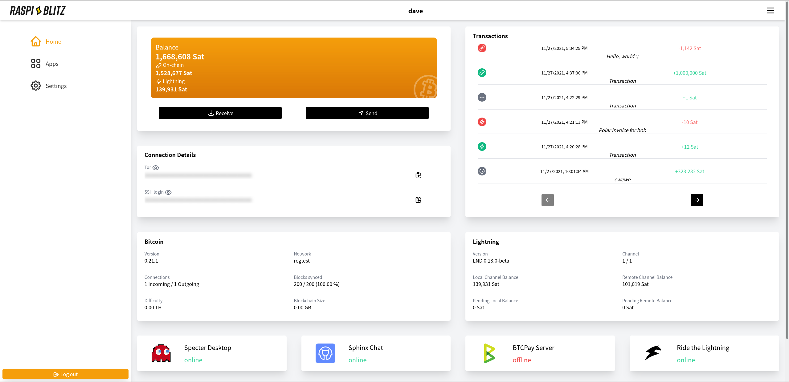

<h1 align="center">Raspiblitz Web - a responsive Web UI for the RaspiBlitz</h1>



In collaboration with [Bitcoin Design](https://bitcoin.design/).

Images of the WebUI can be found at [raspiblitz-web-progress](https://github.com/cstenglein/raspiblitz-web-progress)

Built with [React](https://reactjs.org/) & [Tailwind CSS](https://tailwindcss.com/).

## Translations

If you want to bring the Raspiblitz WebUI to other languages, please help us translate it via [Weblate](https://hosted.weblate.org/projects/raspiblitz-web/translations/) :)

Big thanks to our translators, which you can find in this [README](src/i18n/README.md).

## Development

### Dependencies

- [Node.js](https://nodejs.org/en/download/)
- [nvm](https://github.com/nvm-sh/nvm#intro) is supported but not required.

#### Update npm dependencies

```sh
npm update
```

### Dev workflow

### Simple dev setup

```bash
npm install
cd backend-mock
npm install
cd ..
npm run dev:local
```

The `npm run dev:local` command starts the frontend and the backend mock server.

The backend mock server restarts automatically when you change a file in the `backend-mock` folder.

#### Frontend

```bash
npm install
npm run start
```

#### Backend

For the backend, there currently exist three options:

- Use an existing RaspiBlitz
  - Easy to setup, but needs a RaspiBlitz
- Using the provided [Mock backend](#mock-backend)
  - Easy to setup, but limited data
- Using [blitz_api](#blitz-api) with Polar
  - Some changes needed for local development
  - Possibly more data (depending on your ln setup :) )

##### Mock backend

See [backend-mock folder](./backend-mock)

Open another terminal

```sh
cd backend-mock
npm install
npm run start
```

Then go to `http://localhost:3000` and use the password `password`.

### Testing

#### Unit tests

`npm test`

#### E2E tests

Run tests headless:\
`npx playwright test`

Run test with UI:\
`npx playwright test --ui`

##### Blitz API

This guide uses Polar for easier development, but you can also use a real lightning node.

- Download [Polar](https://lightningpolar.com/) and run it.
  - Create at least one bitcoin and one lightning node.
- Clone the [blitz_api](https://github.com/fusion44/blitz_api) and install the dependencies.
  - In addition, you will need [redis](https://redis.io/) installed for `blitz_api` to work.
- Create a `.env` file (see [.env_sample in blitz_api](https://github.com/fusion44/blitz_api/blob/main/.env_sample)) and copy the bitcoin and ln info into it.
  - Important: When definining `shell_script_path` you need to define a directory where a folder called `config.scripts` and a file called `blitz.debug.sh` reside in. Otherwise `blitz_api` may not work (used on the RaspiBlitz for logging)
- Make the following change in `blitz_api`:
  - In [main/app/main.py](https://github.com/fusion44/blitz_api/blob/main/app/main.py#L48), change the `prefix_format` from `/v{major}` to `/api/v{major}`.
- Change the `BACKEND_SERVER` value in [vite.config.ts](vite.config.ts) to your local `blitz_api` installation.

Now you can start the `blitz_api` and run `npm run start` in raspiblitz-web.

Please do not commit the above changes.

### Use a external RaspiBlitz as Backend

- (Optional): Make sure `nvm` is installed.
- (Optional): Run `nvm install 20` or if already installed `nvm use`
- Install the dependencies with `npm install`
- Change the `BACKEND_SERVER` value in [vite.config.ts](vite.config.ts) to your local RaspiBlitz - for example if your RaspiBlitz is running on local IP `192.168.1.123` then change the value to `http://192.168.1.123:80`
- with `npm run start` it should now connect to your external RaspiBlitz

## Credits & Licenses

### Icons

- RaspiBlitz Icon from [RaspiBlitz](https://github.com/rootzoll/raspiblitz)
  - [MIT License](https://github.com/rootzoll/raspiblitz/blob/v1.10/LICENSE)
- Other icons from [Hero Icons](https://heroicons.com/) & [BitcoinDesign Icons](https://github.com/bitcoindesign/bitcoin-icons)
  - [MIT License Hero Icons](https://github.com/tailwindlabs/heroicons/blob/master/LICENSE)
  - [MIT License Bitcoin-Icons](https://github.com/BitcoinDesign/Bitcoin-Icons/blob/main/LICENSE)
- CSS Loading Spinner from [loading.io](https://loading.io/css/)
  - [CC0 License](https://loading.io/css/)
- ButtonSpinner from [SpinKit](https://github.com/tobiasahlin/SpinKit)
  - [MIT License](https://github.com/tobiasahlin/SpinKit/blob/master/LICENSE)

### App logos

- BTC RPC Logo from [Bitcoin Explorer](https://bitcoinexplorer.org)
  - [MIT License](https://github.com/janoside/btc-rpc-explorer)
- BTCPay Logo from [btcpayserver](https://github.com/btcpayserver/btcpayserver)
  - [MIT License](https://github.com/btcpayserver/btcpayserver/blob/master/LICENSE)
- RTL Logo from [RTL](https://github.com/Ride-The-Lightning/RTL)
  - [MIT License](https://github.com/Ride-The-Lightning/RTL/blob/master/LICENSE)
- Specter Logo from [specter-desktop](https://github.com/cryptoadvance/specter-desktop)
  - [MIT License](https://github.com/cryptoadvance/specter-desktop/blob/master/LICENSE)
- Mempool.space Logo from [mempool](https://github.com/mempool/mempool)
  - [Mempool.space Trademark Policy](https://mempool.space/trademark-policy)
- LNbits Logo from [lnbits-legend](https://github.com/lnbits/lnbits-legend)
  - [MIT License](https://github.com/lnbits/lnbits-legend/blob/master/LICENSE)
- LND Logo from [LightningLabs](https://github.com/lightningnetwork/lnd)
  - [MIT License (?)](https://github.com/lightningnetwork/lnd/blob/master/LICENSE)
- Core Lightning Logo from [Blockstream](https://blockstream.com/)
  - [Blockstream Corporate Brand Guideline](https://blockstream.com/brand-assets/)
- Alby Logo from [Alby media repo](https://github.com/getAlby/media)
  - License unclear
