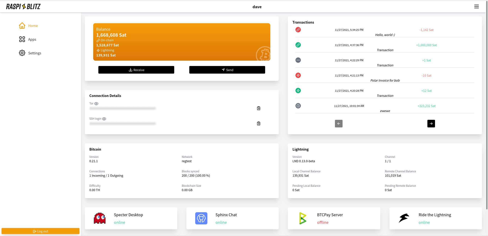

<h1 align="center">Raspiblitz Web - a responsive Web UI for the RaspiBlitz</h1>



In collaboration with [Bitcoin Design](https://bitcoin.design/).

Images of the WebUI can be found at [raspiblitz-web-progress](https://github.com/cstenglein/raspiblitz-web-progress)

Built with [React](https://reactjs.org/) & [Tailwind CSS](https://tailwindcss.com/).

## Translations

If you want to bring the Raspiblitz WebUI to other languages, please help us translate it via [Weblate](https://hosted.weblate.org/projects/raspiblitz-web/translations/) :)

Big thanks to our translators, which you can find in this [README](src/i18n/README.md).

## Development

### Dependencies

- [Node.js](https://nodejs.org/en/download/)
- [asdf](https://asdf-vm.com/) is supported but not required.
- [Nix](https://nixos.org/download.html) with [Flakes](https://nixos.wiki/wiki/Flakes) enabled (optional, for devenv.sh or NixOS builds)

#### Update npm dependencies

```sh
npm update
```

### Development with devenv.sh

This project supports [devenv.sh](https://devenv.sh/), a developer environment tool built on Nix.

#### Setup

1. Install devenv.sh by following the instructions at https://devenv.sh/getting-started/
2. Run `devenv shell` to enter the development environment
3. Devenv will install the npm dependencies automatically when entering the shell. To change this behaviour, change `javascript.npm.install.enable = true;` to `false` and run `npm install` after entering the shell.

#### Benefits of using devenv.sh

- Consistent development environment across all contributors
- Automatically installs the correct version of Node.js and other dependencies
- Includes development tools like TypeScript, Oxlint, Oxfmt, and Nix utilities
- Works on any platform that supports Nix (Linux, macOS, WSL)

### Dev workflow

### Simple dev setup

```bash
npm install
cd backend-mock
npm install
cd ..
npm run dev:local
```

The `npm run dev:local` command starts the frontend and the backend mock server.

The backend mock server restarts automatically when you change a file in the `backend-mock` folder.

#### Frontend

```bash
npm install
npm run start
```

#### Backend

For the backend, there currently exist three options:

- Use an existing RaspiBlitz
  - Easy to setup, but needs a RaspiBlitz
- Using the provided [Mock backend](#mock-backend)
  - Easy to setup, but limited data
- Using [blitz_api](#blitz-api) with Polar
  - Some changes needed for local development
  - Possibly more data (depending on your ln setup :) )

##### Mock backend

See [backend-mock folder](./backend-mock)

Open another terminal

```sh
cd backend-mock
npm install
npm run start
```

Then go to `http://localhost:3000` and use the password `password`.

### Diagnostic builds

Production builds omit source maps by default. To include source maps for
investigating a diagnostic report, run `BUILD_SOURCEMAP=true npm run build`.
Keep the generated maps with the matching build; deploying them also makes
the original source code available to browsers. Diagnostic reports still
include JavaScript and component stacks without source maps.

### Testing

#### Unit tests

`npm test`

#### E2E tests

Install both sets of locked dependencies with `npm ci` and
`npm ci --prefix backend-mock`, then install Chromium with
`npx playwright install chromium`.

Run the mock's WebSocket protocol tests with `npm run test:mock`.

Run browser tests headless with `npm run test:e2e`. Playwright starts a dedicated
mock API on port 8100 and Vite on port 3100, including a test that uses native
WebSockets to verify dashboard snapshots and wallet state updates. These tests
always use the mock, regardless of `BACKEND_SERVER`, and refuse to reuse servers
already occupying their ports. Normal development servers on ports 3000 and 8000
can keep running.

CI runs lint, types, unit tests, mock tests, and builds on Node.js 22 and 24. A
separate Node.js 24 job runs Chromium E2E tests and retains the HTML report for
seven days.

Run test with UI:\
`npx playwright test --ui`

##### Blitz API

This guide uses Polar for easier development, but you can also use a real lightning node.

- Download [Polar](https://lightningpolar.com/) and run it.
  - Create at least one bitcoin and one lightning node.
- Clone the [blitz_api](https://github.com/fusion44/blitz_api) and install the dependencies.
  - In addition, you will need [redis](https://redis.io/) installed for `blitz_api` to work.
- Create a `.env` file (see [.env_sample in blitz_api](https://github.com/fusion44/blitz_api/blob/main/.env_sample)) and copy the bitcoin and ln info into it.
  - Important: When definining `shell_script_path` you need to define a directory where a folder called `config.scripts` and a file called `blitz.debug.sh` reside in. Otherwise `blitz_api` may not work (used on the RaspiBlitz for logging)
- Use a Blitz API version that provides the authenticated `/ws` endpoint.
- Set `BACKEND_SERVER` to the API base URL. For a directly running API, for example:

```sh
BACKEND_SERVER=http://localhost:8000 npm run start
```

The frontend always requests `/api`; Vite replaces this prefix with the path in
`BACKEND_SERVER`. The default is `http://localhost:8000/api` for the mock backend.
This setting applies to development only; production uses `/api` on the current origin.

### Use an external RaspiBlitz as backend

Install dependencies with `npm ci`, then point the development proxy to the node's
API base URL, including `/api` when connecting through nginx:

```sh
BACKEND_SERVER=https://raspiblitz.local/api npm run start
```

For a directly reachable API without nginx, use its base URL without `/api`, for
example `BACKEND_SERVER=http://raspiblitz.local:11111`.

#### Live WebSocket integration test

The optional live test verifies login, initial snapshots, dashboard rendering,
session restoration after reload, reconnection, and logout after the real API
rejects an invalid token. It does not change node settings or initiate wallet
operations. The regular E2E suite always
excludes it; the separate live command requires both environment variables below.
Live tests disable traces, screenshots, and video to avoid retaining credentials.

Playwright starts its own frontend on port 3100 with the selected backend and
refuses to reuse an existing server on that port. In Bash, read the password
without putting it in shell history:

```bash
export BACKEND_SERVER=https://raspiblitz.local/api
read -r -s -p 'Password A: ' BLITZ_API_PASSWORD
export BLITZ_API_PASSWORD
npm run test:e2e:live
unset BLITZ_API_PASSWORD
```

#### Production WebSocket proxy

The reverse proxy must forward WebSocket upgrades for `/api/ws`. A login can succeed
while WebSocket requests return HTTP 404 if nginx strips the upgrade headers. Add
these directives to the existing `/api/` location in the deployment's nginx config:

```nginx
proxy_http_version 1.1;
proxy_set_header Upgrade $http_upgrade;
proxy_set_header Connection "upgrade";
```

Keep the existing API upstream and timeouts. Validate the config with `nginx -t`
before reloading nginx. See [nginx WebSocket proxying](https://nginx.org/en/docs/http/websocket.html).

## Credits & Licenses

### Icons

- RaspiBlitz Icon from [RaspiBlitz](https://github.com/rootzoll/raspiblitz)
  - [MIT License](https://github.com/rootzoll/raspiblitz/blob/v1.10/LICENSE)
- Other icons from [Hero Icons](https://heroicons.com/) & [BitcoinDesign Icons](https://github.com/bitcoindesign/bitcoin-icons)
  - [MIT License Hero Icons](https://github.com/tailwindlabs/heroicons/blob/master/LICENSE)
  - [MIT License Bitcoin-Icons](https://github.com/BitcoinDesign/Bitcoin-Icons/blob/main/LICENSE)
- CSS Loading Spinner from [loading.io](https://loading.io/css/)
  - [CC0 License](https://loading.io/css/)
- ButtonSpinner from [SpinKit](https://github.com/tobiasahlin/SpinKit)
  - [MIT License](https://github.com/tobiasahlin/SpinKit/blob/master/LICENSE)

### App logos

- BTC RPC Logo from [Bitcoin Explorer](https://bitcoinexplorer.org)
  - [MIT License](https://github.com/janoside/btc-rpc-explorer)
- BTCPay Logo from [btcpayserver](https://github.com/btcpayserver/btcpayserver)
  - [MIT License](https://github.com/btcpayserver/btcpayserver/blob/master/LICENSE)
- RTL Logo from [RTL](https://github.com/Ride-The-Lightning/RTL)
  - [MIT License](https://github.com/Ride-The-Lightning/RTL/blob/master/LICENSE)
- Specter Logo from [specter-desktop](https://github.com/cryptoadvance/specter-desktop)
  - [MIT License](https://github.com/cryptoadvance/specter-desktop/blob/master/LICENSE)
- Mempool.space Logo from [mempool](https://github.com/mempool/mempool)
  - [Mempool.space Trademark Policy](https://mempool.space/trademark-policy)
- LNbits Logo from [lnbits-legend](https://github.com/lnbits/lnbits-legend)
  - [MIT License](https://github.com/lnbits/lnbits-legend/blob/master/LICENSE)
- LND Logo from [LightningLabs](https://github.com/lightningnetwork/lnd)
  - [MIT License (?)](https://github.com/lightningnetwork/lnd/blob/master/LICENSE)
- Core Lightning Logo from [Blockstream](https://blockstream.com/)
  - [Blockstream Corporate Brand Guideline](https://blockstream.com/brand-assets/)
- Alby Logo from [Alby media repo](https://github.com/getAlby/media)
  - License unclear
